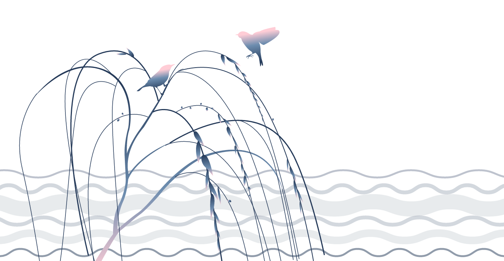
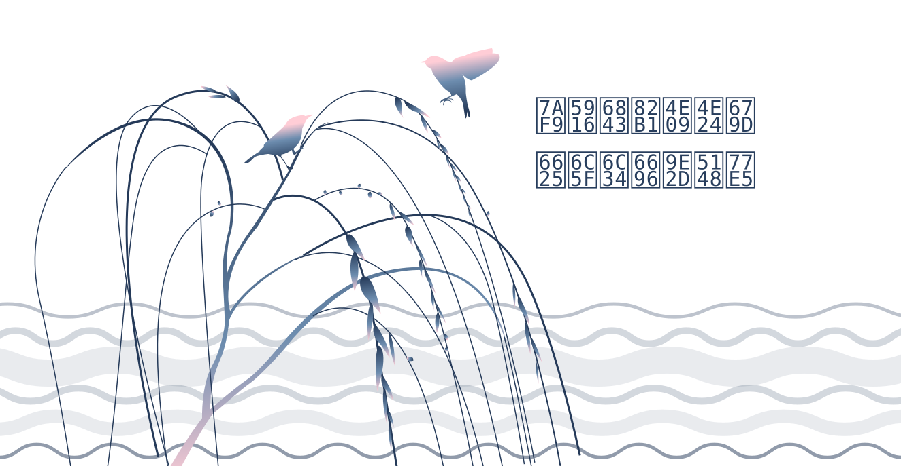
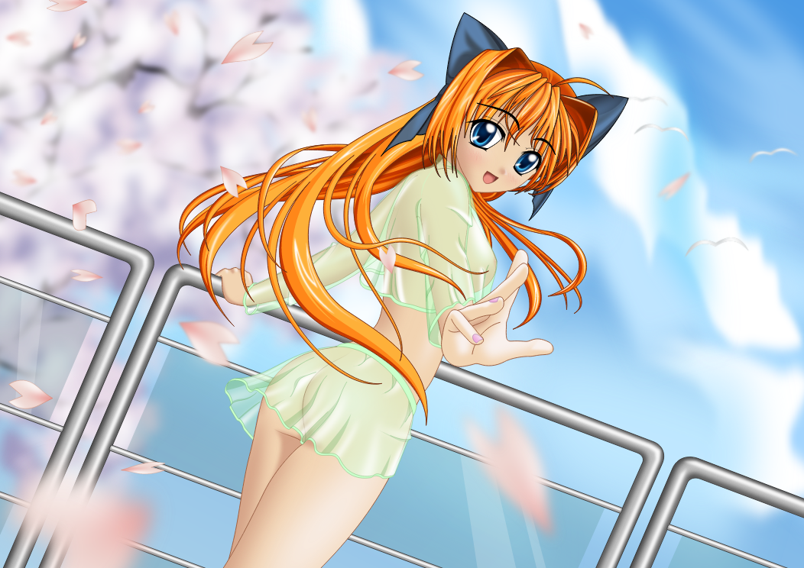
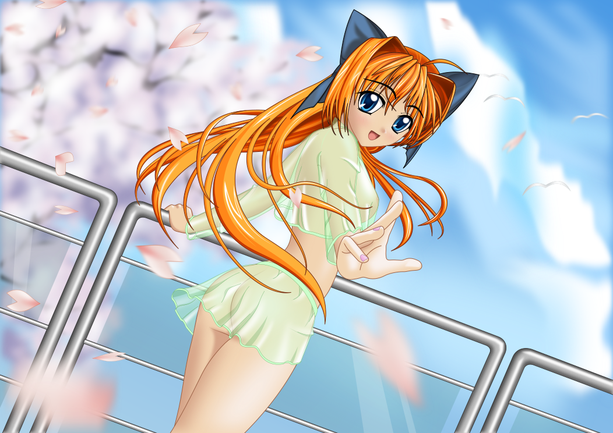

# svg2png-wasm benchmark

```yaml
  System:
    OS: Linux 5.13 Ubuntu 20.04.4 LTS (Focal Fossa)
    CPU: (2) x64 Intel(R) Xeon(R) Platinum 8272CL CPU @ 2.60GHz
    Memory: 5.53 GB / 6.78 GB
  Binaries:
    Node: 16.14.2 - /opt/hostedtoolcache/node/16.14.2/x64/bin/node
    npm: 8.5.0 - /opt/hostedtoolcache/node/16.14.2/x64/bin/npm
  npmPackages:
    sharp: ^0.29.3 => 0.29.3 
    svg2png-wasm: link:.. => 0.0.0-development 
```


## icon

Source SVG: https://github.com/ssssota/svg2png-wasm/raw/main/logo.svg

|Renderer|Speed|Output|
|:-------|----:|:----:|
|svg2png-wasm|2965 ops/s, ±0.28%||
|resvg-js|**4832 ops/s, ±0.78%**||
|resvg|185 ops/s, ±1.59%||
|sharp|516 ops/s, ±1.09%||

_Sat Apr 23 2022 15:47:18 GMT+0000 (Coordinated Universal Time)_


## tiger

Source SVG: https://dev.w3.org/SVG/tools/svgweb/samples/svg-files/tiger.svg

|Renderer|Speed|Output|
|:-------|----:|:----:|
|svg2png-wasm|21 ops/s, ±0.05%||
|resvg-js|**47 ops/s, ±0.68%**||
|resvg|31 ops/s, ±0.68%||
|sharp|24 ops/s, ±0.4%||

_Sat Apr 23 2022 15:47:42 GMT+0000 (Coordinated Universal Time)_


## text

Source SVG: https://raw.githubusercontent.com/yisibl/resvg-js/main/example/text.svg

|Renderer|Speed|Output|
|:-------|----:|:----:|
|svg2png-wasm|3 ops/s, ±0.1%||
|resvg-js|**15 ops/s, ±0.4%**||
|resvg|10 ops/s, ±0.44%||
|sharp|12 ops/s, ±0.89%||

_Sat Apr 23 2022 15:48:08 GMT+0000 (Coordinated Universal Time)_


## animeGirl

Source SVG: https://upload.wikimedia.org/wikipedia/commons/c/c2/Anime_Girl.svg

|Renderer|Speed|Output|
|:-------|----:|:----:|
|svg2png-wasm|0.02 ops/s, ±0.06%||
|resvg-js|**0.21 ops/s, ±0.19%**||
|resvg|0.19 ops/s, ±0.82%||
|sharp|0.2 ops/s, ±30.98%||

_Sat Apr 23 2022 15:56:47 GMT+0000 (Coordinated Universal Time)_

